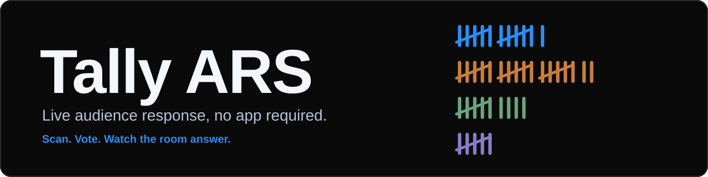
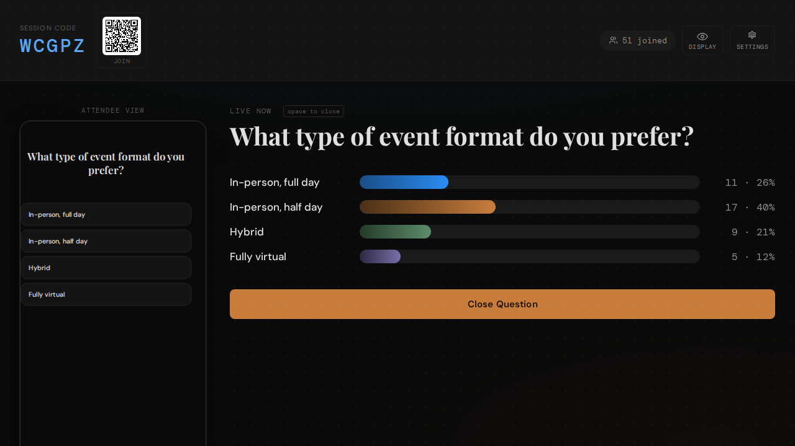
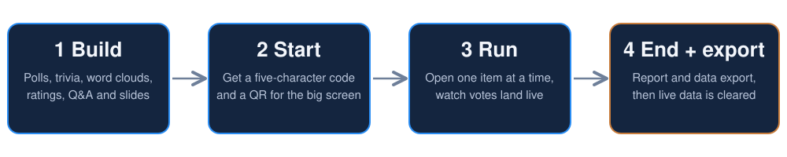
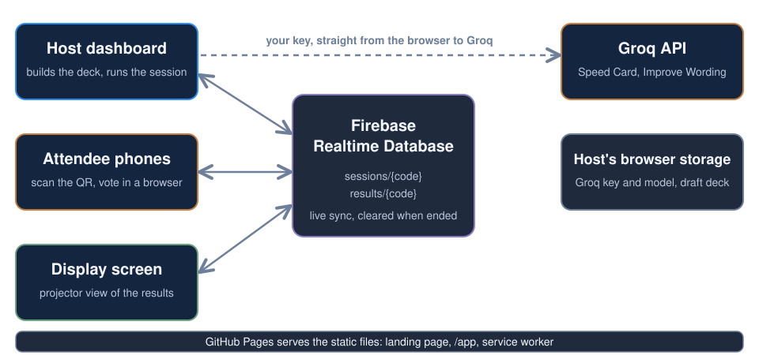

<p align="center"></p>

# Tally ARS

**Live audience response, no app required.**

Tally turns any room into an interactive one. Attendees scan a QR code or type a five-character code on their own phone. No app store, no download, no account. You run the session from one dashboard: open a question, watch the votes land, and move on with a tap or the space bar.

Built for event hosts, trainers and speakers who want a polished audience-response tool without renting clicker hardware.

| | |
|---|---|
| Landing page | https://johnlaz.github.io/tally/ |
| App | https://johnlaz.github.io/tally/app/ |
| Join link format | `https://johnlaz.github.io/tally/app/?join=CODE` |



## How a session runs



1. **Build** a deck of polls, trivia, word clouds, ratings, open Q&A and slides, in any order. Speed Card can draft questions from a topic.
2. **Start** the session to get a join code and QR.
3. **Run** it one item at a time. Votes tally live beside a preview of the attendee view. Space opens, closes and advances.
4. **End and export.** Ending builds a report and exports your data, then clears it from the live database.

Hosts can also send a **Display Screen** view to a projector, share results, and reload a past export to reuse its questions or compare results.

## Repo layout

```
/index.html          landing page
/README.md
/docs/               README visuals (banner.svg, flow.svg, architecture.svg)
/app/index.html      the app (single file: HTML, CSS and JS)
/app/manifest.json   PWA manifest (scope /tally/app/)
/app/sw.js           service worker
/app/icon-192.png    app icons (maskable-safe)
/app/icon-512.png
/app/sample-decks.json   demo decks loaded from Settings
/app/shot-*.png      store and README screenshots
```

Everything is static. Deploy the repo root to GitHub Pages (or any static host) and keep `index.html`, `/app/` and its files together on one origin.

## Architecture



Live sync runs on Firebase Realtime Database. The connection details in `app/index.html` are safe to publish because access is governed by database rules, not by hiding the config (see below).

## AI features (optional)

Speed Card (question generation) and Improve Wording both use a free [Groq](https://groq.com) key added in **Settings → AI**.

- The key is stored only in your browser. It is never written into the app's files, never included in exports, and only sent to Groq.
- Saving a key fetches the chat-capable models your key can use into a picker. **Refresh** re-pulls the list, and it refreshes itself every three days.
- Your chosen model is never swapped automatically. If Groq stops listing it, it stays selected and is flagged in Settings so you can choose another.

## Data and privacy

- No accounts. Attendees can add a name, which is optional.
- Session data exists in Firebase only while the session runs, and is removed when the host ends it. Sessions also carry a three-hour expiry.
- Exports are created on the host's device.
- Decks, drafts, the Groq key and model choice live in the host's browser storage.

### Firebase rules

The app shows a starter ruleset in **Settings** that leaves `sessions/` and `results/` open for read and write. Anyone who knows or guesses a five-character code can read or change that session, and the open write rule lets anyone store arbitrary data under any code. A tighter starting point that restricts writes to well-formed codes and caps name length:

```json
{
  "rules": {
    ".read": false,
    ".write": false,
    "sessions": {
      "$code": {
        ".read": true,
        ".write": "$code.matches(/^[A-HJ-NP-Z2-9]{5}$/)",
        "participants": {
          "$pid": { "name": { ".validate": "newData.isString() && newData.val().length <= 30" } }
        }
      }
    },
    "results": {
      "$code": {
        ".read": true,
        ".write": "$code.matches(/^[A-HJ-NP-Z2-9]{5}$/)"
      }
    }
  }
}
```

This is untested against the live project: try it in the Rules Playground first. Rules alone can't tell a host from an attendee. Real write protection needs Firebase Anonymous Auth with a host id stored on each session, which would be a code change. Also restrict the Firebase API key to `johnlaz.github.io` in Google Cloud.

## Deploy and update

1. Push to the `main` branch with GitHub Pages serving from the repo root.
2. On each release, bump the version in **both** places, which must match:
   - `APP_VERSION` in `app/index.html`
   - `VERSION` in `app/sw.js` (it names the cache)
3. Installed copies show a "new version ready" toast. Updates wait until the host taps **Reload**, so a release never swaps the app mid-session.

The service worker is network-first with a four-second timeout: online hosts always get the latest build, and slow venue wifi falls back to the cached shell. Offline, the shell opens, but live sync, QR generation and exports need a connection.

## Changelog

### 1.1.0
- README banner added.
- Landing page added at the repo root; the duplicate app copy there is gone.
- Flattened layout: two icons (192 and 512, maskable-safe), `sample-decks.json` beside the app, no stray folders.
- Manifest: relative `id`, screenshots for narrow and wide form factors.
- Service worker: versioned cache tied to the in-app version stamp, 4 s network timeout, update waits for the host's Reload.
- Groq model list: a saved model is never auto-replaced; missing models are flagged instead.
- Accessibility: pinch zoom allowed, visible keyboard focus, a real `<h1>`, stronger contrast on the home buttons.
- Fixed blank titles for slides in the dashboard question list.

### 1.0
- First release: Firebase sync, deck library, six question types, Display Screen, Share Results, PNG report export, Speed Card and Improve Wording.

---

*Tally ARS is a LAZLAB Creations project. © 2026 LAZLAB Creations. All Rights Reserved.*
